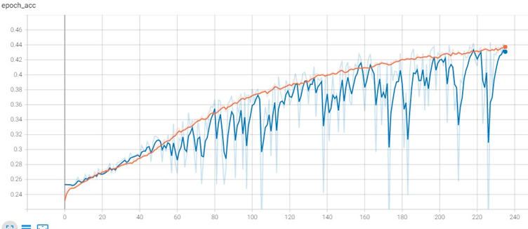
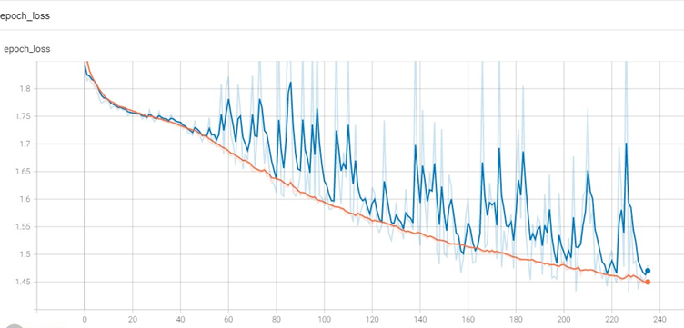
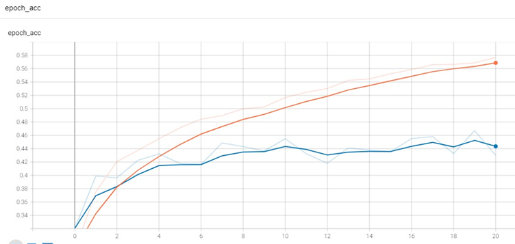
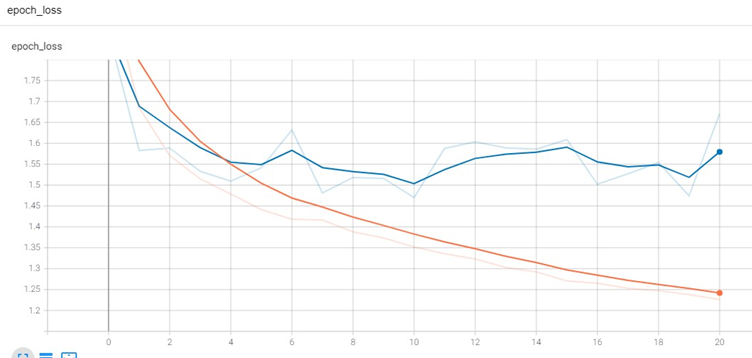
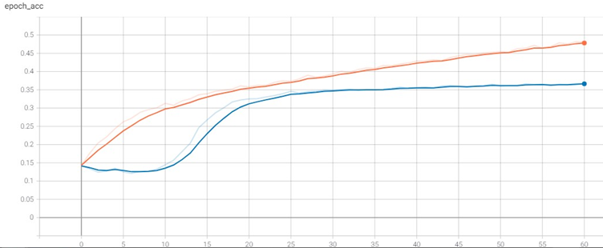
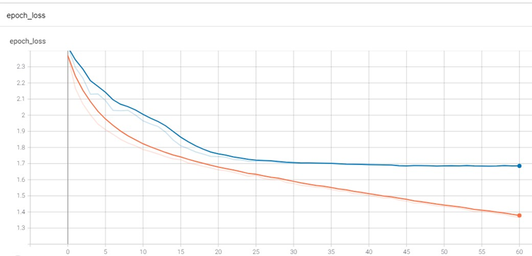
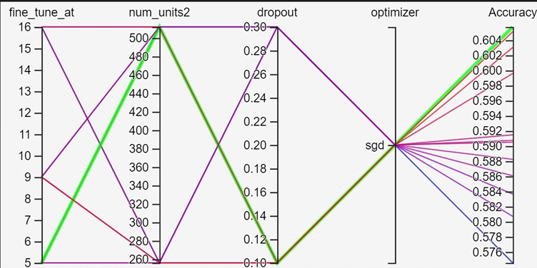
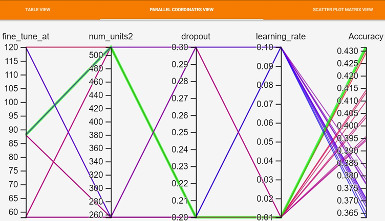

# Facial emotion recognition for e-KYC System Using Transfer Learning
Utilizing deep learning framework using Tensorflow and Keras library to create facial emotion recognition with transfer learning technique based on Convolution Network (CNN),VGG16 and Resnet50 architecture. Advance features including using tensorboard HPARAM to tune hyperparameter and created input pipeline and analysis on pipeline bottleneck in order for the framework to be compatible with big data.

| Package       | Description                                   |
| ------------- |:---------------------------------------------:|
| Tensorflow    | Multiple machine learning tasks library       |
| Keras         | High leval neuralnet library                  | 
| matplotlib    | Visualization library used for plotting graph |
| numpy         | Used for calculate multidimensional array     |
| pandas        | Used for Dataframe manipulation               |    
| datetime      | Deal with dates, times and time intervals     |  

## Results

  
  
  
  
  
  
  
  
  
